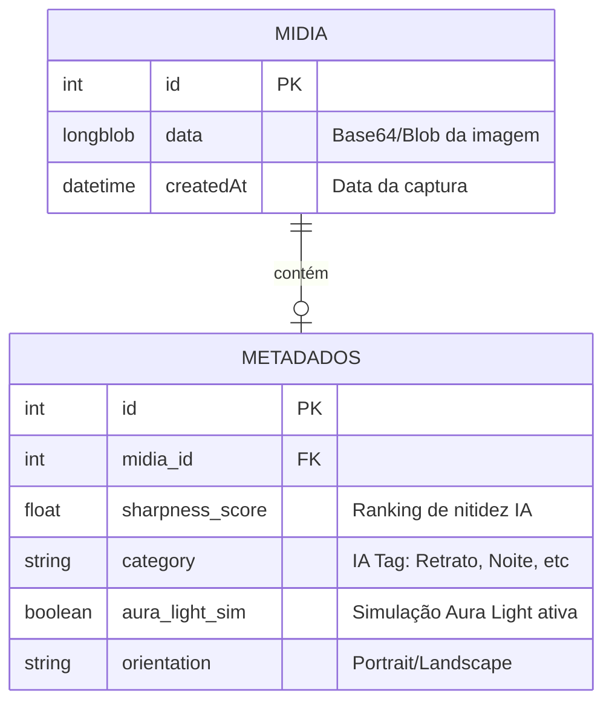

# JOVI-102.1 – MER Conceitual:
**Role:** Arquitetura de Dados
**Data:** 21/04/2026

## 1. Visão Geral
O modelo de dados do JOVI Flow foca em minimalismo e performance local (Offline-first). Os dados são persistidos no navegador via `IndexedDB` para garantir acesso instantâneo e zero latência de rede.

## 2. Diagrama (Mermaid)

## 3. Justificativa do Modelo
- **Separação de Preocupações:** A entidade `MIDIA` guarda apenas o essencial para visualização rápida (Blob), enquanto `METADADOS` armazena o resultado do processamento da IA e configurações de hardware.
- **Offline-First:** O uso de `IndexedDB` permite que o ranking por nitidez funcione mesmo sem internet.
- **Escalabilidade:** Permite adicionar novas tags de IA futuramente sem alterar a estrutura da mídia original.
